# Software Requirements Specification (SRS)

## CyberShield — Cyber Crime Complaint and Investigation Management System

**Version:** 1.0  
**Date:** June 2026  
**Author:** Abdul

---

## 1. Introduction

### 1.1 Purpose
This document specifies the software requirements for **CyberShield**, a web-based platform that enables citizens to report cyber crimes, track complaint status, and enables law enforcement to manage investigations efficiently.

### 1.2 Scope
CyberShield is a full-stack web application with three user roles — Citizen, Investigator, and System Admin. The system provides secure complaint registration, case tracking via unique IDs, investigation management tools, and an admin oversight panel.

### 1.3 Definitions & Acronyms

| Term | Definition |
|---|---|
| **Citizen** | A registered user who files cyber crime complaints |
| **Investigator** | A law enforcement officer assigned to investigate cases |
| **Admin** | System administrator with full platform oversight |
| **Tracking ID** | A unique alphanumeric ID assigned to each complaint |
| **JWT** | JSON Web Token — used for secure authentication |
| **RBAC** | Role-Based Access Control |

---

## 2. Overall Description

### 2.1 Product Perspective
CyberShield replaces traditional, paper-based cyber crime complaint processes with a secure digital platform. It integrates:
- A **React.js** frontend for user interaction
- A **Node.js/Express** backend for business logic and API routing
- A **MongoDB** database for flexible data storage
- Optional **Python ML microservice** for auto-categorization

### 2.2 User Classes and Characteristics

| User Class | Description | Technical Proficiency |
|---|---|---|
| **Citizen** | General public, victims of cyber crimes | Low to Medium |
| **Investigator** | Police officers / cyber crime unit personnel | Medium |
| **System Admin** | IT staff managing the platform | High |

### 2.3 Operating Environment
- **Client:** Modern web browsers (Chrome, Firefox, Edge, Safari)
- **Server:** Node.js v18+ runtime environment
- **Database:** MongoDB 6.0+ (local or Atlas cloud)
- **Deployment:** Vercel (frontend), Render (backend), MongoDB Atlas (database)

### 2.4 Design Constraints
- Must comply with data privacy best practices
- All sensitive data must be encrypted at rest and in transit
- System must support concurrent users without degradation
- Application must be responsive (mobile, tablet, desktop)

---

## 3. Functional Requirements

### 3.1 Authentication & Authorization

| ID | Requirement | Priority |
|---|---|---|
| FR-AUTH-01 | Users can register with name, email, phone, and password | High |
| FR-AUTH-02 | Users can log in with email and password | High |
| FR-AUTH-03 | System issues JWT tokens upon successful login | High |
| FR-AUTH-04 | System enforces role-based access (Citizen, Investigator, Admin) | High |
| FR-AUTH-05 | Users can reset their password via email | Medium |
| FR-AUTH-06 | Session expires after 24 hours of inactivity | Medium |

### 3.2 Citizen Features

| ID | Requirement | Priority |
|---|---|---|
| FR-CIT-01 | Citizens can file a new cyber crime complaint | High |
| FR-CIT-02 | Complaint form includes: title, description, crime category, date of incident | High |
| FR-CIT-03 | Citizens can upload digital evidence (images, PDFs, screenshots) | High |
| FR-CIT-04 | System generates a unique Tracking ID upon submission | High |
| FR-CIT-05 | Citizens can track complaint status using Tracking ID | High |
| FR-CIT-06 | Citizens can view a list of all their submitted complaints | High |
| FR-CIT-07 | Citizens receive notifications on case status updates | Medium |
| FR-CIT-08 | Citizens can add additional information to existing complaints | Medium |
| FR-CIT-09 | Citizens can communicate with assigned investigator | Medium |

### 3.3 Investigator Features

| ID | Requirement | Priority |
|---|---|---|
| FR-INV-01 | Investigators can view their assigned cases | High |
| FR-INV-02 | Investigators can update investigation status | High |
| FR-INV-03 | Investigators can add investigation notes/logs | High |
| FR-INV-04 | Investigators can view uploaded evidence | High |
| FR-INV-05 | Investigators can communicate with the complainant | Medium |
| FR-INV-06 | Investigators can mark cases as Resolved or Closed | High |
| FR-INV-07 | Investigators can request additional evidence from citizens | Medium |
| FR-INV-08 | Investigators can set case priority (Low, Medium, High, Critical) | Medium |

### 3.4 Admin Features

| ID | Requirement | Priority |
|---|---|---|
| FR-ADM-01 | Admins can view all complaints across the system | High |
| FR-ADM-02 | Admins can assign/reassign investigators to cases | High |
| FR-ADM-03 | Admins can manage user accounts (create, deactivate, delete) | High |
| FR-ADM-04 | Admins can view system-wide statistics and analytics | Medium |
| FR-ADM-05 | Admins can manage crime categories | Medium |
| FR-ADM-06 | Admins can generate reports (complaints by category, status, time period) | Medium |
| FR-ADM-07 | Admins can configure system settings | Low |

### 3.5 Complaint Lifecycle

```
┌──────────┐    ┌──────────────┐    ┌──────────┐    ┌─────────────────────┐    ┌──────────┐
│ Submitted│───▶│ Under Review │───▶│ Assigned │───▶│ Under Investigation │───▶│ Resolved │
└──────────┘    └──────────────┘    └──────────┘    └─────────────────────┘    └──────────┘
                       │                                      │                      │
                       ▼                                      ▼                      ▼
                 ┌──────────┐                           ┌──────────┐           ┌──────────┐
                 │ Rejected │                           │  Closed  │           │  Closed  │
                 └──────────┘                           └──────────┘           └──────────┘
```

**Status Definitions:**

| Status | Description | Triggered By |
|---|---|---|
| **Submitted** | Complaint has been filed by the citizen | System (auto) |
| **Under Review** | Admin is reviewing the complaint for validity | Admin |
| **Rejected** | Complaint deemed invalid or out of scope | Admin |
| **Assigned** | Case assigned to an investigator | Admin |
| **Under Investigation** | Investigator is actively working on the case | Investigator |
| **Resolved** | Investigation complete, action taken | Investigator |
| **Closed** | Case officially closed | Admin / Investigator |

---

## 4. Crime Categories

| # | Category | Examples |
|---|---|---|
| 1 | Financial Fraud | UPI fraud, credit card theft, online banking scam |
| 2 | Identity Theft | Fake profiles, Aadhaar misuse, stolen credentials |
| 3 | Online Harassment / Cyberbullying | Threats, trolling, defamation on social media |
| 4 | Phishing / Social Engineering | Fake emails, deceptive links, OTP fraud |
| 5 | Ransomware / Malware Attack | Encrypted files, trojans, spyware |
| 6 | Data Breach | Leaked personal data, unauthorized access |
| 7 | Online Scam | Job fraud, lottery scam, e-commerce fraud |
| 8 | Other | Any cyber crime not fitting the above categories |

---

## 5. Non-Functional Requirements

### 5.1 Performance

| ID | Requirement |
|---|---|
| NFR-PERF-01 | Page load time should be under 3 seconds |
| NFR-PERF-02 | API response time should be under 500ms for standard operations |
| NFR-PERF-03 | System should handle 100+ concurrent users |

### 5.2 Security

| ID | Requirement |
|---|---|
| NFR-SEC-01 | All passwords must be hashed using bcrypt |
| NFR-SEC-02 | Sensitive data encrypted at rest (AES-256) |
| NFR-SEC-03 | HTTPS enforced for all communications |
| NFR-SEC-04 | Protection against XSS, CSRF, and injection attacks |
| NFR-SEC-05 | File uploads validated and sanitized |
| NFR-SEC-06 | Rate limiting on authentication endpoints |

### 5.3 Usability

| ID | Requirement |
|---|---|
| NFR-USE-01 | Responsive design for mobile, tablet, and desktop |
| NFR-USE-02 | Intuitive navigation with consistent UI patterns |
| NFR-USE-03 | Form validation with clear error messages |
| NFR-USE-04 | Accessibility compliance (WCAG 2.1 Level AA) |

### 5.4 Reliability

| ID | Requirement |
|---|---|
| NFR-REL-01 | System uptime of 99.5% |
| NFR-REL-02 | Automated database backups |
| NFR-REL-03 | Graceful error handling with user-friendly messages |

---

## 6. Use Cases

### 6.1 Use Case Diagram

```mermaid
graph TB
    subgraph CyberShield System
        UC1["Register Account"]
        UC2["Login"]
        UC3["File Complaint"]
        UC4["Upload Evidence"]
        UC5["Track Complaint"]
        UC6["View Notifications"]
        UC7["Communicate with Investigator"]
        UC8["View Assigned Cases"]
        UC9["Update Investigation Status"]
        UC10["Add Investigation Notes"]
        UC11["Resolve / Close Case"]
        UC12["Manage Users"]
        UC13["Assign Investigators"]
        UC14["View Analytics"]
        UC15["Generate Reports"]
        UC16["Review Complaints"]
    end

    Citizen((Citizen))
    Investigator((Investigator))
    Admin((Admin))

    Citizen --> UC1
    Citizen --> UC2
    Citizen --> UC3
    Citizen --> UC4
    Citizen --> UC5
    Citizen --> UC6
    Citizen --> UC7

    Investigator --> UC2
    Investigator --> UC8
    Investigator --> UC9
    Investigator --> UC10
    Investigator --> UC11
    Investigator --> UC7

    Admin --> UC2
    Admin --> UC12
    Admin --> UC13
    Admin --> UC14
    Admin --> UC15
    Admin --> UC16
```



### 6.2 Detailed Use Cases

---

#### UC-01: Register Account

| Field | Details |
|---|---|
| **Actor** | Citizen |
| **Precondition** | User has a valid email address |
| **Main Flow** | 1. User navigates to registration page<br>2. User enters name, email, phone, and password<br>3. System validates input<br>4. System creates account with "Citizen" role<br>5. System redirects to login page |
| **Postcondition** | User account created in the database |
| **Exception** | Email already registered → show error message |

---

#### UC-02: File Complaint

| Field | Details |
|---|---|
| **Actor** | Citizen |
| **Precondition** | User is logged in as Citizen |
| **Main Flow** | 1. Citizen clicks "File New Complaint"<br>2. Citizen fills in complaint title, description, category, and date<br>3. Citizen optionally uploads evidence files<br>4. Citizen submits the complaint<br>5. System generates a unique Tracking ID<br>6. System saves complaint with status "Submitted"<br>7. Citizen receives confirmation with Tracking ID |
| **Postcondition** | Complaint stored in database; Tracking ID generated |
| **Exception** | File size exceeds limit → show error; Missing required fields → show validation errors |

---

#### UC-03: Track Complaint Status

| Field | Details |
|---|---|
| **Actor** | Citizen |
| **Precondition** | Citizen has filed at least one complaint |
| **Main Flow** | 1. Citizen navigates to "My Complaints"<br>2. System displays all complaints with statuses<br>3. Citizen clicks on a complaint to view details<br>4. System shows full complaint details, status timeline, and investigator notes (if shared) |
| **Postcondition** | Citizen views current complaint status |

---

#### UC-04: Assign Investigator to Case

| Field | Details |
|---|---|
| **Actor** | Admin |
| **Precondition** | Complaint is in "Under Review" status |
| **Main Flow** | 1. Admin reviews submitted complaint<br>2. Admin selects an available investigator<br>3. Admin assigns the case<br>4. System updates status to "Assigned"<br>5. Investigator and Citizen receive notifications |
| **Postcondition** | Case assigned; status updated; notifications sent |

---

#### UC-05: Update Investigation

| Field | Details |
|---|---|
| **Actor** | Investigator |
| **Precondition** | Case is assigned to the investigator |
| **Main Flow** | 1. Investigator opens assigned case<br>2. Investigator reviews complaint details and evidence<br>3. Investigator adds investigation notes<br>4. Investigator updates case status<br>5. System notifies citizen of status change |
| **Postcondition** | Investigation log updated; citizen notified |

---

## 7. Assumptions & Dependencies

### Assumptions
- Users have access to a modern web browser with JavaScript enabled
- Users have a valid email address for registration
- Law enforcement personnel are pre-registered or registered by Admin
- Stable internet connection is available for all users

### Dependencies
- MongoDB Atlas for cloud database hosting
- Cloudinary or local storage for evidence file uploads
- Email service (e.g., Nodemailer + SMTP) for notifications
- JWT library for authentication tokens

---

## 8. Appendix

### A. Approval History

| Version | Date | Author | Description |
|---|---|---|---|
| 1.0 | June 2026 | Abdul | Initial SRS document |
