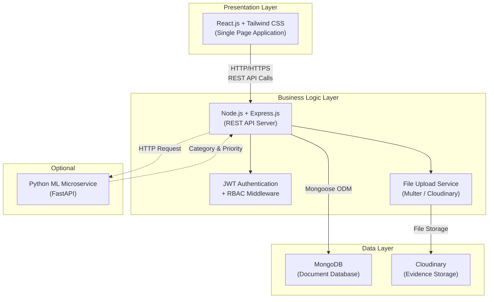
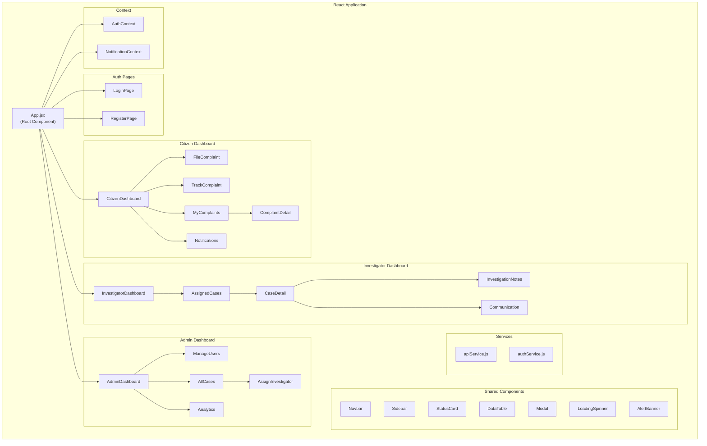
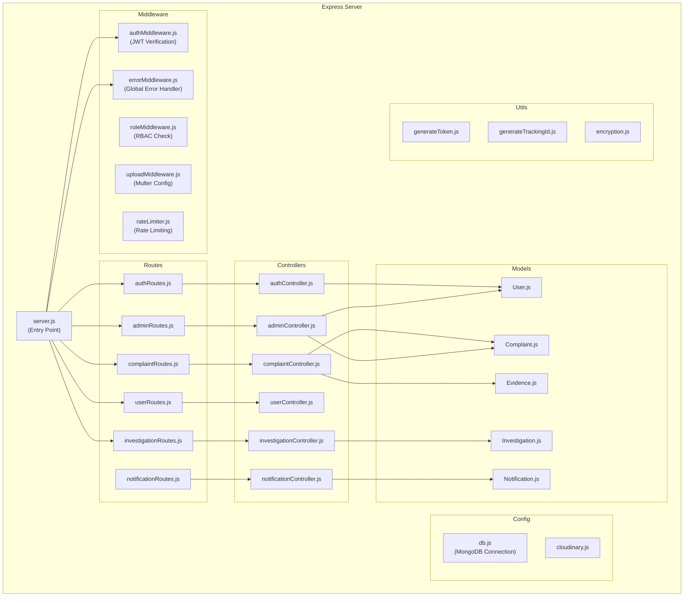
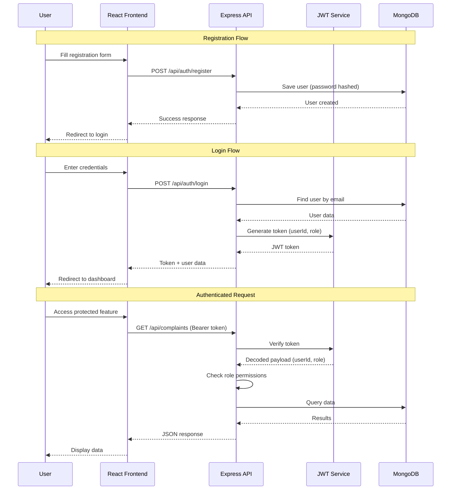
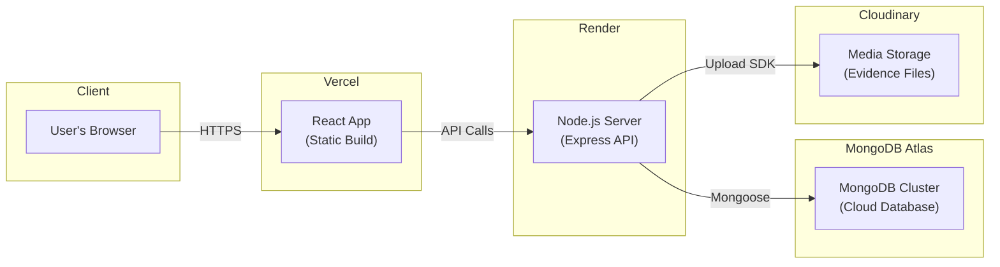

# System Architecture — CyberShield

## CyberShield — Cyber Crime Complaint and Investigation Management System

**Version:** 1.0  
**Date:** June 2026

---

## 1. High-Level Architecture

CyberShield follows a **3-Tier Architecture** with a clear separation between the presentation layer, business logic layer, and data layer.



---

## 2. Architecture Pattern

### Client-Server with REST API

| Layer | Technology | Responsibility |
|---|---|---|
| **Frontend** | React.js + Tailwind CSS | User interface, form handling, routing, state management |
| **Backend** | Node.js + Express.js | API routing, business logic, authentication, authorization |
| **Database** | MongoDB (Mongoose ODM) | Data persistence, querying, indexing |
| **File Storage** | Cloudinary / Local uploads | Secure evidence file storage and retrieval |
| **ML Service** | Python FastAPI *(optional)* | Complaint auto-categorization and priority prediction |

---

## 3. Component Diagram

### 3.1 Frontend Components



### 3.2 Backend Components



---

## 4. API Endpoint Design

### 4.1 Authentication APIs

| Method | Endpoint | Description | Access |
|---|---|---|---|
| POST | `/api/auth/register` | Register a new citizen account | Public |
| POST | `/api/auth/login` | Login and receive JWT token | Public |
| POST | `/api/auth/forgot-password` | Request password reset | Public |
| POST | `/api/auth/reset-password` | Reset password with token | Public |
| GET | `/api/auth/profile` | Get current user profile | Authenticated |
| PUT | `/api/auth/profile` | Update current user profile | Authenticated |

### 4.2 Complaint APIs

| Method | Endpoint | Description | Access |
|---|---|---|---|
| POST | `/api/complaints` | File a new complaint | Citizen |
| GET | `/api/complaints` | Get all complaints (filtered by role) | Authenticated |
| GET | `/api/complaints/:id` | Get complaint details by ID | Authenticated |
| GET | `/api/complaints/track/:trackingId` | Track complaint by Tracking ID | Citizen |
| PUT | `/api/complaints/:id` | Update complaint details | Citizen (own) |
| PUT | `/api/complaints/:id/status` | Update complaint status | Investigator / Admin |
| POST | `/api/complaints/:id/evidence` | Upload evidence files | Citizen |
| GET | `/api/complaints/:id/evidence` | Get evidence list | Authenticated |

### 4.3 Investigation APIs

| Method | Endpoint | Description | Access |
|---|---|---|---|
| GET | `/api/investigations` | Get all investigations | Investigator / Admin |
| GET | `/api/investigations/:complaintId` | Get investigation for a complaint | Authenticated |
| POST | `/api/investigations/:complaintId/notes` | Add investigation note | Investigator |
| PUT | `/api/investigations/:complaintId/priority` | Set case priority | Investigator |
| POST | `/api/investigations/:complaintId/communicate` | Send message to citizen | Investigator |

### 4.4 Admin APIs

| Method | Endpoint | Description | Access |
|---|---|---|---|
| GET | `/api/admin/users` | Get all users | Admin |
| POST | `/api/admin/users` | Create user (investigator) | Admin |
| PUT | `/api/admin/users/:id` | Update user details/role | Admin |
| DELETE | `/api/admin/users/:id` | Deactivate user account | Admin |
| PUT | `/api/admin/complaints/:id/assign` | Assign investigator to case | Admin |
| GET | `/api/admin/stats` | Get system statistics | Admin |
| GET | `/api/admin/reports` | Generate reports | Admin |

### 4.5 Notification APIs

| Method | Endpoint | Description | Access |
|---|---|---|---|
| GET | `/api/notifications` | Get user's notifications | Authenticated |
| PUT | `/api/notifications/:id/read` | Mark notification as read | Authenticated |
| PUT | `/api/notifications/read-all` | Mark all as read | Authenticated |

---

## 5. Authentication & Authorization Flow



### Role-Based Middleware Logic

```
Request → authMiddleware (verify JWT) → roleMiddleware (check role) → Controller

Roles Hierarchy:
  - Admin    → Full access to all endpoints
  - Investigator → Access to investigation + own profile endpoints
  - Citizen  → Access to complaint filing + tracking + own profile
```

---

## 6. Deployment Architecture



| Service | Platform | Purpose |
|---|---|---|
| Frontend | Vercel | Static site hosting with CDN |
| Backend | Render | Node.js server hosting |
| Database | MongoDB Atlas | Cloud database (Free Tier available) |
| File Storage | Cloudinary | Evidence file uploads (Free Tier available) |

---

## 7. Security Architecture

| Security Measure | Implementation |
|---|---|
| **Password Hashing** | bcrypt with salt rounds = 12 |
| **Authentication** | JWT with 24h expiry, HTTP-only cookies |
| **Authorization** | Role-based middleware (RBAC) |
| **Data Encryption** | AES-256 for sensitive fields |
| **HTTPS** | TLS/SSL enforced in production |
| **Input Validation** | Express-validator for all inputs |
| **XSS Protection** | Helmet.js security headers |
| **CSRF Protection** | CSRF tokens for state-changing requests |
| **Rate Limiting** | express-rate-limit (100 req/15min for auth) |
| **File Validation** | MIME type checking, file size limits (10MB) |
| **CORS** | Restricted to frontend domain only |
