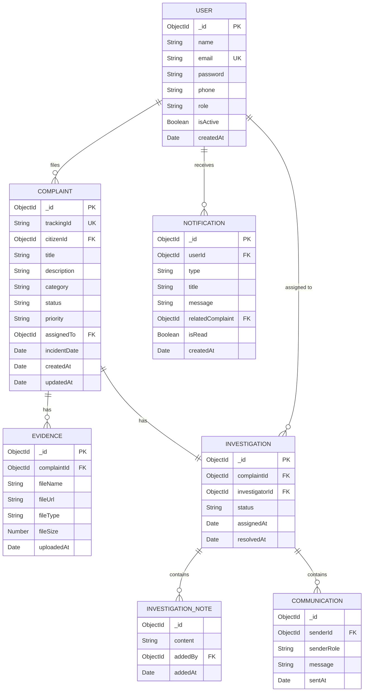

# Database Schema Design — CyberShield

## CyberShield — Cyber Crime Complaint and Investigation Management System

**Database:** MongoDB (NoSQL Document Database)  
**ODM:** Mongoose  
**Version:** 1.0  
**Date:** June 2026

---

## 1. Schema Overview



---

## 2. Collection Schemas

### 2.1 Users Collection

Stores all user accounts — Citizens, Investigators, and Admins.

```javascript
// models/User.js
const userSchema = new mongoose.Schema({
  name: {
    type: String,
    required: [true, 'Name is required'],
    trim: true,
    minlength: 2,
    maxlength: 100
  },
  email: {
    type: String,
    required: [true, 'Email is required'],
    unique: true,
    lowercase: true,
    trim: true,
    match: [/^\S+@\S+\.\S+$/, 'Please enter a valid email']
  },
  password: {
    type: String,
    required: [true, 'Password is required'],
    minlength: 8,
    select: false  // Not returned in queries by default
  },
  phone: {
    type: String,
    trim: true,
    match: [/^[0-9]{10}$/, 'Please enter a valid 10-digit phone number']
  },
  role: {
    type: String,
    enum: ['citizen', 'investigator', 'admin'],
    default: 'citizen'
  },
  isActive: {
    type: Boolean,
    default: true
  },
  profileImage: {
    type: String,
    default: null
  },
  resetPasswordToken: String,
  resetPasswordExpire: Date
}, {
  timestamps: true  // Adds createdAt and updatedAt
});

// Indexes
userSchema.index({ email: 1 });
userSchema.index({ role: 1 });
```

**Sample Document:**
```json
{
  "_id": "665f1a2b3c4d5e6f7a8b9c0d",
  "name": "Abdul Rahman",
  "email": "abdul@example.com",
  "password": "$2b$12$hashedPasswordHere...",
  "phone": "9876543210",
  "role": "citizen",
  "isActive": true,
  "profileImage": null,
  "createdAt": "2026-06-28T08:00:00.000Z",
  "updatedAt": "2026-06-28T08:00:00.000Z"
}
```

---

### 2.2 Complaints Collection

Stores all cyber crime complaints filed by citizens.

```javascript
// models/Complaint.js
const complaintSchema = new mongoose.Schema({
  trackingId: {
    type: String,
    unique: true,
    required: true
    // Auto-generated: "CS-2026-XXXXXX"
  },
  citizenId: {
    type: mongoose.Schema.Types.ObjectId,
    ref: 'User',
    required: true
  },
  title: {
    type: String,
    required: [true, 'Complaint title is required'],
    trim: true,
    maxlength: 200
  },
  description: {
    type: String,
    required: [true, 'Description is required'],
    maxlength: 5000
  },
  category: {
    type: String,
    required: [true, 'Category is required'],
    enum: [
      'Financial Fraud',
      'Identity Theft',
      'Online Harassment / Cyberbullying',
      'Phishing / Social Engineering',
      'Ransomware / Malware Attack',
      'Data Breach',
      'Online Scam',
      'Other'
    ]
  },
  status: {
    type: String,
    enum: [
      'Submitted',
      'Under Review',
      'Rejected',
      'Assigned',
      'Under Investigation',
      'Resolved',
      'Closed'
    ],
    default: 'Submitted'
  },
  priority: {
    type: String,
    enum: ['Low', 'Medium', 'High', 'Critical'],
    default: 'Medium'
  },
  assignedTo: {
    type: mongoose.Schema.Types.ObjectId,
    ref: 'User',
    default: null
  },
  incidentDate: {
    type: Date,
    required: [true, 'Date of incident is required']
  },
  additionalInfo: {
    type: String,
    maxlength: 3000,
    default: null
  },
  rejectionReason: {
    type: String,
    default: null
  }
}, {
  timestamps: true
});

// Indexes
complaintSchema.index({ trackingId: 1 });
complaintSchema.index({ citizenId: 1 });
complaintSchema.index({ assignedTo: 1 });
complaintSchema.index({ status: 1 });
complaintSchema.index({ category: 1 });
complaintSchema.index({ createdAt: -1 });
```

**Tracking ID Format:** `CS-YYYY-XXXXXX`
- `CS` → CyberShield prefix
- `YYYY` → Year
- `XXXXXX` → 6-character alphanumeric unique code

**Sample Document:**
```json
{
  "_id": "665f1b3c4d5e6f7a8b9c0d1e",
  "trackingId": "CS-2026-A7B3K9",
  "citizenId": "665f1a2b3c4d5e6f7a8b9c0d",
  "title": "Online Banking Fraud - Unauthorized Transaction",
  "description": "Rs. 50,000 was debited from my savings account...",
  "category": "Financial Fraud",
  "status": "Assigned",
  "priority": "High",
  "assignedTo": "665f1a2b3c4d5e6f7a8b9c0e",
  "incidentDate": "2026-06-25T00:00:00.000Z",
  "additionalInfo": null,
  "rejectionReason": null,
  "createdAt": "2026-06-28T09:30:00.000Z",
  "updatedAt": "2026-06-28T10:15:00.000Z"
}
```

---

### 2.3 Evidence Collection

Stores metadata for evidence files uploaded by citizens.

```javascript
// models/Evidence.js
const evidenceSchema = new mongoose.Schema({
  complaintId: {
    type: mongoose.Schema.Types.ObjectId,
    ref: 'Complaint',
    required: true
  },
  uploadedBy: {
    type: mongoose.Schema.Types.ObjectId,
    ref: 'User',
    required: true
  },
  fileName: {
    type: String,
    required: true,
    trim: true
  },
  originalName: {
    type: String,
    required: true
  },
  fileUrl: {
    type: String,
    required: true
  },
  fileType: {
    type: String,
    required: true,
    enum: ['image/jpeg', 'image/png', 'image/gif', 'application/pdf',
           'text/plain', 'video/mp4', 'application/msword',
           'application/vnd.openxmlformats-officedocument.wordprocessingml.document']
  },
  fileSize: {
    type: Number,
    required: true,
    max: 10 * 1024 * 1024  // 10MB max
  },
  description: {
    type: String,
    maxlength: 500,
    default: null
  }
}, {
  timestamps: true
});

// Indexes
evidenceSchema.index({ complaintId: 1 });
```

**Sample Document:**
```json
{
  "_id": "665f1c4d5e6f7a8b9c0d1e2f",
  "complaintId": "665f1b3c4d5e6f7a8b9c0d1e",
  "uploadedBy": "665f1a2b3c4d5e6f7a8b9c0d",
  "fileName": "evidence_1719561000_screenshot.png",
  "originalName": "bank_transaction_screenshot.png",
  "fileUrl": "https://res.cloudinary.com/cybershield/image/upload/v1719561000/evidence/screenshot.png",
  "fileType": "image/png",
  "fileSize": 245760,
  "description": "Screenshot of unauthorized transaction notification",
  "createdAt": "2026-06-28T09:30:00.000Z"
}
```

---

### 2.4 Investigation Collection

Stores investigation details, notes, and communication for each complaint.

```javascript
// models/Investigation.js
const investigationSchema = new mongoose.Schema({
  complaintId: {
    type: mongoose.Schema.Types.ObjectId,
    ref: 'Complaint',
    required: true,
    unique: true
  },
  investigatorId: {
    type: mongoose.Schema.Types.ObjectId,
    ref: 'User',
    required: true
  },
  status: {
    type: String,
    enum: ['Active', 'On Hold', 'Completed'],
    default: 'Active'
  },
  notes: [{
    content: {
      type: String,
      required: true,
      maxlength: 2000
    },
    addedBy: {
      type: mongoose.Schema.Types.ObjectId,
      ref: 'User',
      required: true
    },
    addedAt: {
      type: Date,
      default: Date.now
    }
  }],
  communications: [{
    senderId: {
      type: mongoose.Schema.Types.ObjectId,
      ref: 'User',
      required: true
    },
    senderRole: {
      type: String,
      enum: ['citizen', 'investigator'],
      required: true
    },
    message: {
      type: String,
      required: true,
      maxlength: 2000
    },
    sentAt: {
      type: Date,
      default: Date.now
    }
  }],
  findings: {
    type: String,
    maxlength: 5000,
    default: null
  },
  assignedAt: {
    type: Date,
    default: Date.now
  },
  resolvedAt: {
    type: Date,
    default: null
  }
}, {
  timestamps: true
});

// Indexes
investigationSchema.index({ complaintId: 1 });
investigationSchema.index({ investigatorId: 1 });
investigationSchema.index({ status: 1 });
```

**Sample Document:**
```json
{
  "_id": "665f1d5e6f7a8b9c0d1e2f3a",
  "complaintId": "665f1b3c4d5e6f7a8b9c0d1e",
  "investigatorId": "665f1a2b3c4d5e6f7a8b9c0e",
  "status": "Active",
  "notes": [
    {
      "_id": "665f1e6f7a8b9c0d1e2f3a4b",
      "content": "Contacted the bank for transaction logs. Awaiting response.",
      "addedBy": "665f1a2b3c4d5e6f7a8b9c0e",
      "addedAt": "2026-06-28T11:00:00.000Z"
    },
    {
      "_id": "665f1f7a8b9c0d1e2f3a4b5c",
      "content": "Bank confirmed unauthorized access from IP 192.168.x.x",
      "addedBy": "665f1a2b3c4d5e6f7a8b9c0e",
      "addedAt": "2026-06-29T14:30:00.000Z"
    }
  ],
  "communications": [
    {
      "senderId": "665f1a2b3c4d5e6f7a8b9c0e",
      "senderRole": "investigator",
      "message": "Please share any OTP or phishing messages you may have received.",
      "sentAt": "2026-06-28T12:00:00.000Z"
    }
  ],
  "findings": null,
  "assignedAt": "2026-06-28T10:15:00.000Z",
  "resolvedAt": null,
  "createdAt": "2026-06-28T10:15:00.000Z",
  "updatedAt": "2026-06-29T14:30:00.000Z"
}
```

---

### 2.5 Notifications Collection

Stores in-app notifications for all users.

```javascript
// models/Notification.js
const notificationSchema = new mongoose.Schema({
  userId: {
    type: mongoose.Schema.Types.ObjectId,
    ref: 'User',
    required: true
  },
  type: {
    type: String,
    enum: [
      'complaint_submitted',
      'complaint_under_review',
      'complaint_assigned',
      'complaint_rejected',
      'status_update',
      'new_message',
      'case_resolved',
      'case_closed',
      'evidence_requested'
    ],
    required: true
  },
  title: {
    type: String,
    required: true,
    maxlength: 200
  },
  message: {
    type: String,
    required: true,
    maxlength: 500
  },
  relatedComplaint: {
    type: mongoose.Schema.Types.ObjectId,
    ref: 'Complaint',
    default: null
  },
  isRead: {
    type: Boolean,
    default: false
  }
}, {
  timestamps: true
});

// Indexes
notificationSchema.index({ userId: 1, isRead: 1 });
notificationSchema.index({ createdAt: -1 });

// Auto-delete notifications older than 30 days
notificationSchema.index({ createdAt: 1 }, { expireAfterSeconds: 30 * 24 * 60 * 60 });
```

**Sample Document:**
```json
{
  "_id": "665f207a8b9c0d1e2f3a4b5c",
  "userId": "665f1a2b3c4d5e6f7a8b9c0d",
  "type": "complaint_assigned",
  "title": "Investigator Assigned",
  "message": "Your complaint CS-2026-A7B3K9 has been assigned to an investigator.",
  "relatedComplaint": "665f1b3c4d5e6f7a8b9c0d1e",
  "isRead": false,
  "createdAt": "2026-06-28T10:15:00.000Z"
}
```

---

## 3. Indexing Strategy

| Collection | Index | Type | Purpose |
|---|---|---|---|
| Users | `{ email: 1 }` | Unique | Fast login lookup |
| Users | `{ role: 1 }` | Regular | Filter by role |
| Complaints | `{ trackingId: 1 }` | Unique | Fast tracking lookup |
| Complaints | `{ citizenId: 1 }` | Regular | Citizen's complaints |
| Complaints | `{ assignedTo: 1 }` | Regular | Investigator's cases |
| Complaints | `{ status: 1 }` | Regular | Filter by status |
| Complaints | `{ category: 1 }` | Regular | Filter by category |
| Complaints | `{ createdAt: -1 }` | Regular | Sort by newest |
| Evidence | `{ complaintId: 1 }` | Regular | Evidence per complaint |
| Investigations | `{ complaintId: 1 }` | Unique | One investigation per complaint |
| Investigations | `{ investigatorId: 1 }` | Regular | Investigator's cases |
| Notifications | `{ userId: 1, isRead: 1 }` | Compound | Unread notifications |
| Notifications | `{ createdAt: 1 }` | TTL (30 days) | Auto-cleanup |

---

## 4. Data Validation Rules

| Field | Validation | Reason |
|---|---|---|
| `email` | Regex + unique constraint | Prevent duplicates, ensure format |
| `password` | Min 8 chars, hashed via bcrypt | Security |
| `phone` | 10 digits only | Standard format |
| `fileSize` | Max 10MB | Prevent abuse |
| `fileType` | Whitelist of MIME types | Security (prevent malicious uploads) |
| `description` | Max 5000 chars | Prevent excessive data |
| `trackingId` | Unique, auto-generated | Prevent conflicts |

---

## 5. Relationships Summary

| Relationship | Type | Description |
|---|---|---|
| User → Complaints | One-to-Many | A citizen can file multiple complaints |
| Complaint → Evidence | One-to-Many | A complaint can have multiple evidence files |
| Complaint → Investigation | One-to-One | Each complaint has one investigation record |
| User → Investigations | One-to-Many | An investigator handles multiple cases |
| User → Notifications | One-to-Many | A user receives multiple notifications |
| Investigation → Notes | Embedded Array | Notes are embedded within the investigation |
| Investigation → Communications | Embedded Array | Messages are embedded within the investigation |
